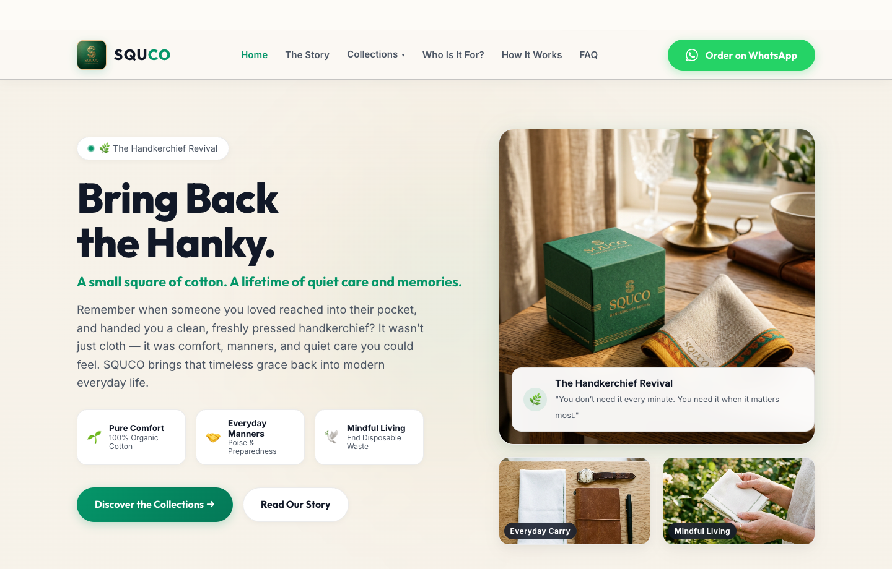
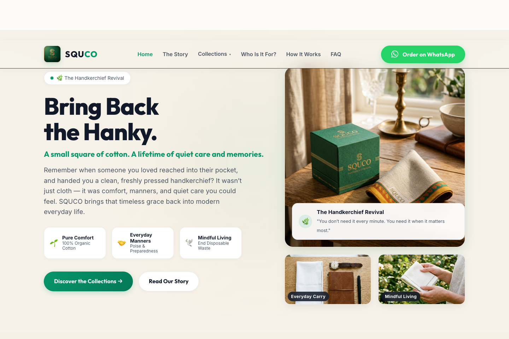
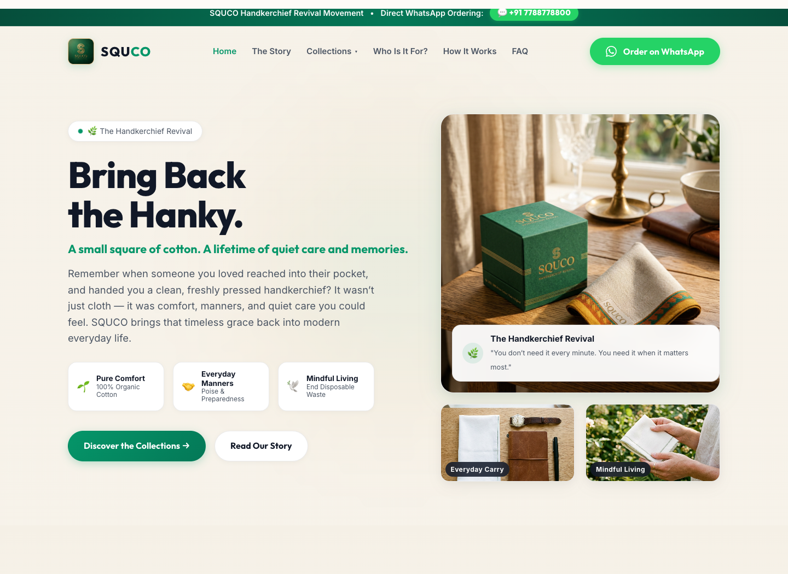
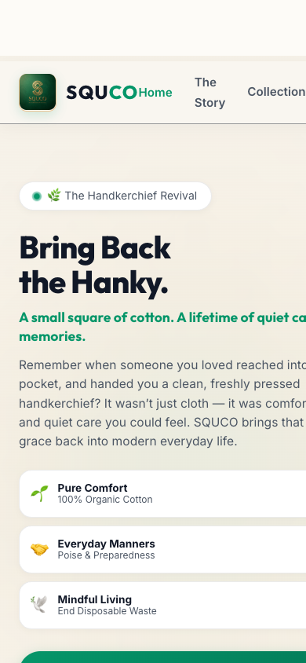

# SQUCO — The Handkerchief Revival 🌿

> **"A Small Square of Cotton. A Lifetime of Quiet Care and Memories."**  
> Bringing back the timeless habit of carrying a handkerchief into modern everyday life.

[](https://squco.in)
[](https://wa.me/919019921521)

---

## 📸 Visual Showcase

### 1. Hero Section & Movement Slogan


---

### 2. The 4 Curated Collection Pillars


---

### 3. "Who Should Carry a SQUCO?" Persona Matrix


---

### 4. "A Hanky for Every Moment" Emotional Journey


---

### 5. #BringBackTheHanky Movement & Workflow


---

### 6. Mobile-First Responsive Experience
<p align="center">
  
</p>

---

## 🌟 Brand Manifesto & Core Pillars

Once, carrying a handkerchief was simply part of everyday life. Somewhere along the way, disposable culture took over and we stopped carrying something simpler and far more personal. **SQUCO** is here to bring that small, essential habit back through modern design, mindful materials, and frictionless direct ordering.

### The 4 Core Collection Pillars

1. **🌿 Everyday Collection** (Habit • Pure Organic Cotton • Everyday Utility):
   - *SQUCO Daily Pure Cotton (2×2×2" Zigzag Cube)*
   - *Handwoven Artisan Pit-Loom Ikat Cotton*
   - *Grown-ups Executive Linen-Cotton (1×1×3" Slim Stick)*
   - *Morning Commuter Micro-Waffle Quick-Dry Hanky*
   - *Minimalist Raw Earth (100% Undyed Organic Cotton)*

2. **🎉 Festival & Occasion Collection** (Sacred Keepsakes • Romance • Milestones):
   - *🌸 Raksha Bandhan Saffron & Gold Keepsake (Sibling Protection Bond)*
   - *🪔 Sabitri Brata Crimson & Gold Temple Hanky (Auspicious Blessings)*
   - *🎪 Rath Yatra Sacred Nandighosa Pit-Loom Hanky (Pilgrimage & Heritage)*
   - *✨ New Year Fresh Start Edition (Pristine White Egyptian Combed Cotton)*
   - *🤝 Friendship Day 'Always With You' Twin Set (Complementary Blue & Honey Gold)*
   - *🌹 Valentine's Day Rose Embroidered Love Keepsake (Whisper-soft Romance)*
   - *💕 Marriage Handkerchief Set (Blood Red Silk First Night Keepsake Box)*
   - *🎁 Moments Worth Remembering (Wedding & Milestone Return Gift)*

3. **💼 Corporate & Executive Collection** (Identity • Sustainability • Prestige):
   - *SQUCO Corporate (Custom Logo Embroidery for ESG Gifting)*
   - *Corporate ESG Sustainability Starter Box (GOTS Certified Zero-Waste)*
   - *Leadership Heritage Black & Gold Case (CXO & Board Member Milestone)*
   - *Global Delegate Welcome Hanky Set (2×2×2" Travel Cube for Summits)*

4. **🧸 Kids & Little Pockets Collection** (Delight • Hygiene • Childhood Habits):
   - *🦁 Kids Safari Friends (Baby Lion, Panda & Elephant Embroidery)*
   - *🍓 Kids Sweet Fruits (Smiling Strawberry & Watermelon Double-Gauze)*
   - *🎒 Kids School Uniform Classic (Write-on Name Tag Edition)*
   - *🎨 Kids Little Artist (Rainbow Stitching for Messy Play & Painting)*
   - *🌙 Kids Bedtime Dreamer (Organic Muslin Comfort Cloth)*

---

## 📦 Packaging Innovations (Inches System)

- **2 × 2 × 2 Inches Signature Zigzag Pocket Cube**: Slide effortlessly into any pocket, bag, or car cup-holder with instant accordion opening.
- **1 × 1 × 3 Inches Slim Stick Single Pack**: Tailored for breast pockets, executive suits, and evening clutches.
- **3 × 3 × 1 Inches Kids Flat Pocket Pack**: Designed for small school pinafores and shorts pockets.

---

## 💬 Direct WhatsApp Commerce (`9019921521`)

- Zero checkout friction, no passwords, no shopping cart abandonment.
- Every collection card links directly via WhatsApp deep links (`wa.me/919019921521`) with pre-filled customization requests.

---

## 🛠️ File Structure

```text
squco.in/
├── index.html                  # Accessible semantic HTML5 layout
├── css/
│   └── style.css               # Vanilla CSS design system & micro-interactions
├── js/
│   └── app.js                  # Dynamic 4-pillar datastore, modals & WhatsApp utility
├── assets/
│   ├── logo/
│   │   ├── logo.jpg            # Gold-embossed emerald ribbon S logo
│   │   └── logo.png
│   ├── hero/
│   │   ├── hero-hanky-packet.jpg
│   │   ├── hero-flatlay.jpg
│   │   └── hero-carry.jpg
│   └── products/               # 22 curated product visuals across 4 pillars
├── screenshots/                # Section previews embedded in README
├── robots.txt
├── sitemap.xml
└── README.md
```

---

## 🚀 Running Locally

```bash
# Start a local static HTTP server
python3 -m http.server 8080

# Open in your browser
open http://localhost:8080
```

---

## 📜 Copyright & License

© 2026 SQUCO. All rights reserved. **#BringBackTheHanky**
